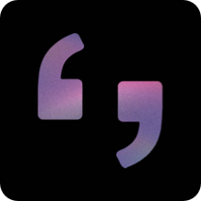

<!-- PROJECT LOGO -->

<h3>   iQoute  
<a href="https://drive.google.com/file/d/1jhqD3NLq1ruabJON4HXeXB5yQlgDmdWS/view?usp=sharing">Demo</a>   </h3>   
 
   
  
 
## Overveiw

<video src="https://drive.google.com/file/d/1jhqD3NLq1ruabJON4HXeXB5yQlgDmdWS/view?usp=sharing" controls="controls" style="max-width: 730px;">
</video>

### Big Idea
Productivity.

### Challenge Statment
Built tools to help productive people.

### Solution Concept
Help reader to save their best quotes.

### Tools
[![Swift][Swift-img]][Swift-url]   [![Sketch][Sketch-img]][Sketch-url]   [![Xcode][Xcode-img]][Xcode-url]

### Technologies Used
- Accessability (Voice control)
- Vision  Kit 
- Core Data

### Language Support
- Arabic
- English

## Challenge Summary

## Success Criteria
- Project is completed on time ✅
- Design interfaces that support both LTR - RTL languages ✅
- Localize your app to support multiple languages ✅
- Build an app that supports Apple’s built-in accessibility settings ✅

## Team Members

<a href="https://www.linkedin.com/in/SumayaAlzahrani/">Sumaya Alzahrani</a> - <a href="https://www.linkedin.com/in/sara-a-mohammed101/">Sara Alhumidi</a> 

<!-- MARKDOWN LINKS & IMAGES -->
<!-- https://www.markdownguide.org/basic-syntax/#reference-style-links -->
[Swift-img]: https://img.shields.io/badge/-Swift-green
[Swift-url]: https://developer.apple.com/swift/

[Sketch-img]: https://img.shields.io/badge/-Sketch-orange
[Sketch-url]: https://www.sketch.com

[Xcode-img]: https://img.shields.io/badge/-Xcode-blue
[Xcode-url]: https://developer.apple.com/xcode/
